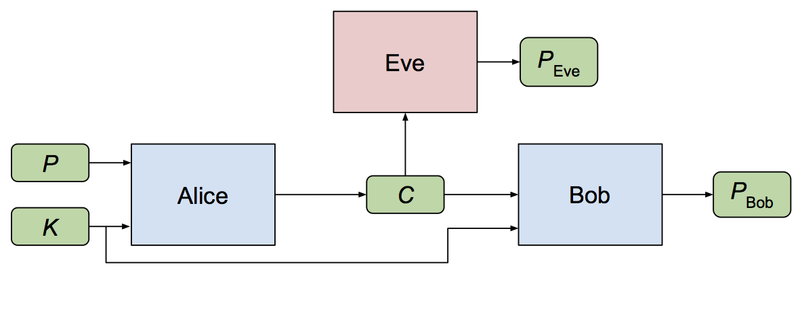
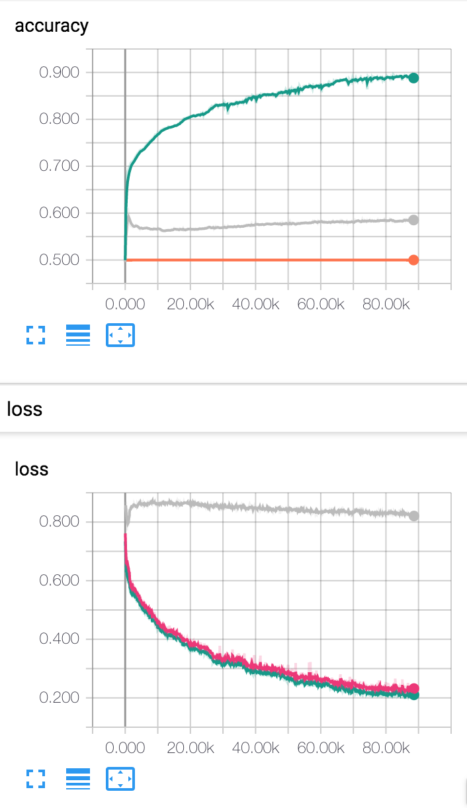

# LearningToProtect
Implementation of [Learning to Protect Communications with Adversarial Neural Cryptography](https://arxiv.org/abs/1610.06918) in PyTorch

**Caution**: Details of implementation differ much from the original paper. I tried to use dense(fc) layers with relu activation, instead of dense+conv1d+sigmoid. See `model/model.py`.

## Requirements

`pip install -r requirements.txt` (PyTorch, Numpy, TensorboardX)

## Train

`python trainer.py -c config/default.yaml -n [name of run]`

- You may copy `cp config/default.yaml config/config.yaml` and change parameters (e.g. size of plain/key/cipher, depth of NN, …) to experiment with your own setting.

## Tensorboard

`tensorboard --logdir logs/`

## Results

Result with `config/default.yaml`, trained on GTX 1080 for 1 hour.

- Accuracy: (Green: Bob, Gray: Eve, Orange: Random guess)
- Loss: (Green: B, Gray: E, Magenta: AB)

## License
Apache License v2.0
